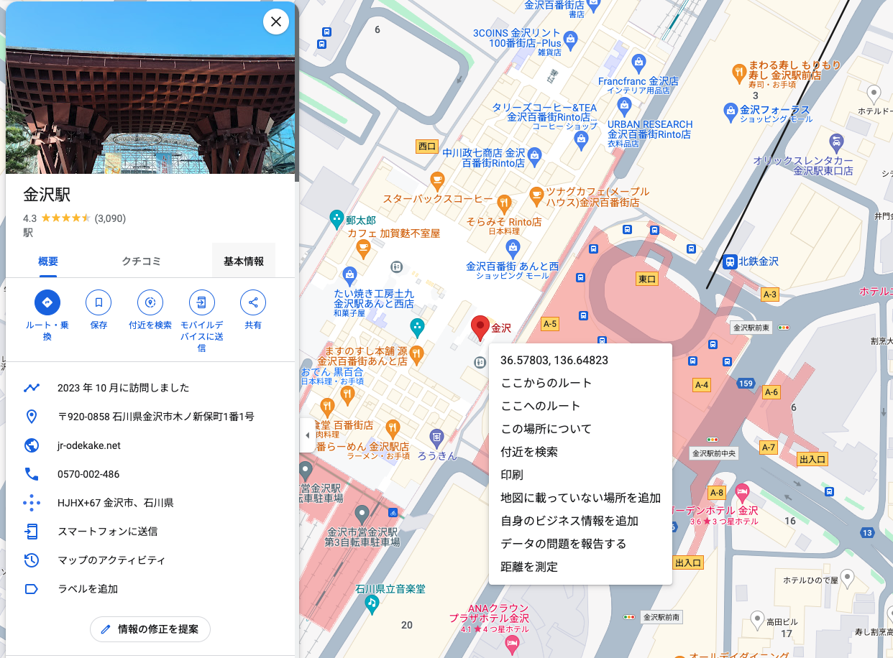

## このリポジトリについて

このNext.jsプロジェクトは、令和6年能登半島地震で被災した方への支援プロジェクトです。  
給水拠点や、温浴施設の開放など、困っている人が助かる情報を即座に出せるサイトを目指して制作しています。

[石川県防災ポータル](https://pref-ishikawa.my.salesforce-sites.com/)と被らないデータを提供していく予定です。


とりあえずChatGPTと一緒にゴリゴリ骨組みだけ書いた状態なので、今後情報の追加と更新をしていく予定です。
もし何か不具合があれば、Issueまたは[X(Twitter)](https://twitter.com/t0m0120)へご連絡ください。

掲載依頼についても受け付けております。
[Googleフォーム](https://forms.gle/gEsLfsiKgKFCByfs7)から入力をお願いいたします。


## 開発方法について

git clone後に、.env.localを作成し、GoogleMapのAPIKey MapIDを打ち込む。

```.env.local 
NEXT_PUBLIC_GOOGLE_MAPS_API_KEY="1234"
NEXT_PUBLIC_MAP_ID="abcd"
```

```sh
$ npm install
$ npm run dev
ローカル環境が立ち上がります。
```

## ファイルについて

### ./app

[AppRouter](https://nextjs.org/docs/app)を使っていますが、特に機能は使っていません。
情報のジャンルに合わせて、フォルダを追加し、`<SentouMapView />`を表示するだけの簡単なページです。

### GoogleMapAPI

GoogleMAPの表示には、[visgl/react-google-maps](https://github.com/visgl/react-google-maps)を使用しています。
ドキュメントは[こちら](https://visgl.github.io/react-google-maps/)。

### マップに表示するピンのデータについて

`./points_data`配下にそれぞれの情報ごとにファイルを分けて保存しています。
現状、下記のようにデータを保存しています。
```
["地名", "注意事項/公式サイト、SNSへのリンク", 緯度, 経度]
```

####  緯度経度について

GoogleMapを右クリックした際に、緯度経度が保存できるので、そちらを利用しています。
サンプルでは、(36.578029012052355, 136.64822544150843)を取得しています。




## このリポジトリの運用について

特に細かい運用方針などは決めません。
データの更新や軽微なデザインの修正などは、即PR入れていただいてもらって構いません。
大きい変更を予定している場合には、Issueを切ってから作業をお願いします。

管理者の自分は、masterに入れてしまっています🙇‍♂